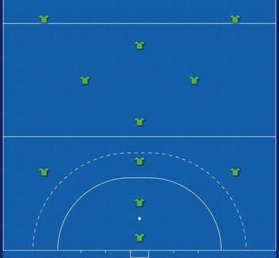
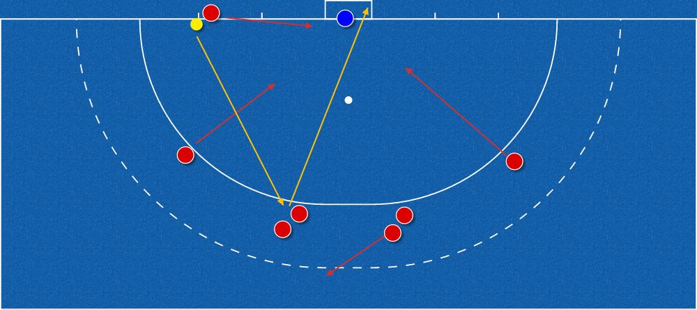
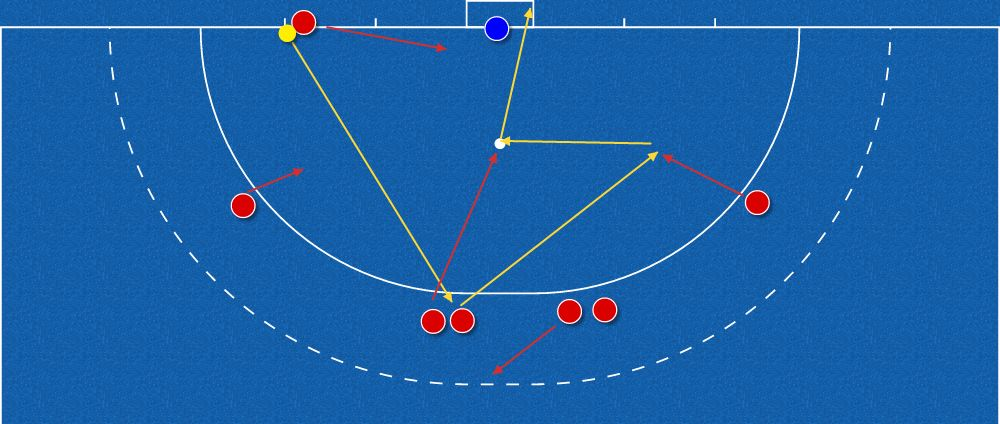
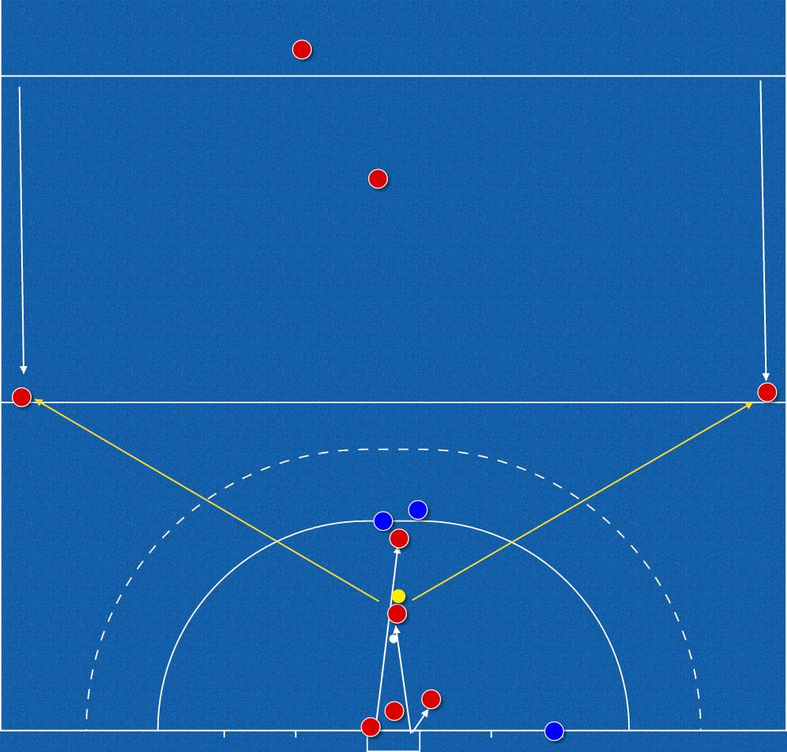

## Our Approach

- Keep it simple unless we can threaten the D. Ball retention comes first:
  - Think about the outcome. After you've had the ball, does our team still have
    possession?
  - If it's a 50/50 pass, don't make it. Go for the option with a higher
    probability of success.
- In the defensive triangle and final third, we man mark.
- Out of possession, we push the ball (opposition) to our right side of the pitch
  where possible.
- **No chat to the umpires, opposition or team mates, and no silly cards
  (unneeded fouls).**
- If we are down to 10, revert to a half-court press immediately, unless we are
  losing in the last 5 minutes.

> **Above all: enjoy your hockey, and help make it enjoyable for everyone else
> too.**

## Formation

We will typically play a **4-1-3-2 diamond**: 4 at the back, a diamond of 4 in
midfield (1 holding, 3 ahead of them), and 2 up front.

Example (our half, our goal at the bottom):

| Line | Players | Position in the example |
|------|---------|-------------------------|
| Goalkeeper | 1 | In goal |
| Defence (4) | Sweeper | Centre, inside the D in front of the penalty spot |
| | Left back, right back | Wide, level with the edge of the dashed circle |
| | Centre half | Centre, on the dashed circle in front of the D |
| Holding mid (1) | Defensive mid | Centre, just in front of our 25 |
| Midfield (3) | Left mid, right mid | Inside channels, between the 25 and halfway |
| | Attacking mid | Centre, just short of halfway |
| Forwards (2) | Left forward, right forward | Wide, on the halfway line |

## Penalty Corners

### Attacking

#### To discuss before the first game

- Who is injecting and who is stopping.
- Proposal: have 2 castles, so it isn't clear to the opposition where to run.
  The 2nd castle could just be a dummy: they don't need to be able to stop or
  strike.

#### 1. Straight strike (first option)

**On our first penalty corner of the match, we hit the ball.** Why:

- It tests the keeper: how they set, and how they handle pace.
- It scares the defenders. Runners who have been hit once are often slower and
  less committed on the corners that follow.
- It shows us who their runners are and how they come out, so we know what we're
  working with later.
- It sets up the next corner: once they expect the hit, the flick and the slip
  are more likely to come off.

Executing it:

- It may go head-high, but that's acceptable for the first corner.
- **Exception:** if U16s or juniors are defending, don't intentionally strike at
  head height. It isn't in the spirit of the game.

#### 2. Flick (second option)

- Choose a side and send runners accordingly.
- If flicking left: get the rebound runner and postman on the left side.
- If flicking bottom right: the runner goes to the back post.

Options 1 and 2:

#### 3. Right slip (third option)

A disguised play off the normal setup:

1. Inject as normal to the castle at the top of the D.
2. Either the stopper or the striker passes to the right slip.
3. The right slip immediately knocks it back to the striker on the penalty spot
   for the shot.

### Defending

The back 4 defend corners (unless someone doesn't want to). The setup is up to the
GK, but generally:

#### Starting positions

Two defenders on either side of the goal:

| Left side | Right side |
|-----------|------------|
| No. 1 runner (runs from the left post) | No. 2 runner (runs from the right) |
| Left postman | Right postman (on the right post) |

#### On the injection

- **No. 1 runner:** to the ball.
- **No. 2 runner:** to just beyond the penalty spot.
- **Right postman:** to just short of the penalty spot, but cover back to the
  injector.
- **Left postman:** cover the post.

#### Outlets

- Two of the players at the halfway line need to get back to the 25, so the
  defenders have an outlet to either side. This allows us to clear the ball quickly
  and launch a fast counter attack.

